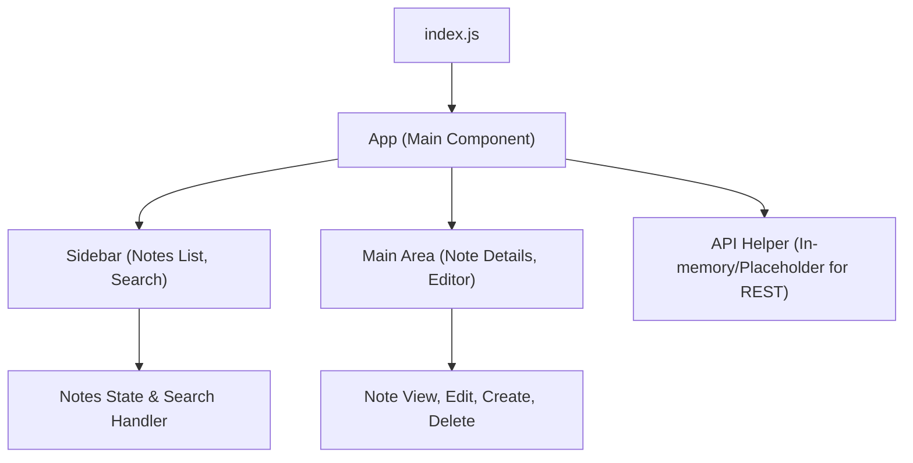

# Simple Notes Frontend – Project Documentation

## Overview

The Simple Notes Frontend is a lightweight and modern single-page React application that allows users to create, edit, delete, and manage notes efficiently. Designed with a minimalistic yet responsive UI, the app emphasizes speed, clarity, and ease of modification, providing an intuitive experience without reliance on heavyweight UI frameworks. This frontend connects to a backend via REST API calls (mocked within the sample), and focuses on core note-management functionality for personal data organization.

## Architecture

The app is structured as a Single Page Application (SPA) using React. The main entry point is `src/index.js`, which mounts the root `App` component. Internal state management is handled with React's `useState` and `useEffect` hooks. The UI is split into two main regions:

- **Sidebar**: Displays the list of notes and a search bar for text filtering.
- **Main Content Area**: Shows the details of the selected note, as well as the editing and creation forms.

### Component Structure

All logic currently resides in a single main component (`App.js`), leveraging a modular approach for CRUD handlers, UI rendering, and request management. Component state and note data are managed locally in-memory for simplicity, but the design allows for easy extension to real REST API endpoints.

Below is an architectural diagram showing the main relations:

### UI Flow

- On application load, a list of notes is retrieved (from the mock API) and displayed in the sidebar.
- Users can:
  - Select a note to view its details in the main area.
  - Edit or delete the selected note.
  - Create a new note with the "New" button.
  - Search notes by title/content using the search bar.

### Technologies Used

- **React 18**: Frontend framework for building UI (`react`, `react-dom`, `react-scripts` in `package.json`)
- **Vanilla CSS**: All styling done in `App.css` and `index.css` using CSS custom properties for theming.
- **Jest & React Testing Library**: For unit testing (`setupTests.js`, `App.test.js`), following React's default Create React App setup.
- **ESLint**: JavaScript/JSX linting (`eslint.config.mjs`).
- **No external UI frameworks**: UI is built with plain HTML/CSS and modern React patterns.

## Main UI Components

- **App (`src/App.js`)**: The main component orchestrating layout, state, and all CRUD operations. Implements:
    - Sidebar: Notes listing, "New" note button, search input.
    - Main Area: Displays either selected note, no-note message, or the note editor (for creation/edit).
    - Responsive styling logic for mobile and desktop.

- **Sidebar**:
    - Lists notes with brief titles.
    - Allows note selection, updates highlight for active note.
    - Includes a search bar to filter notes in real time.
    - Provides a prominent "New" button to create notes.

- **Note Editor/Main View**:
    - Shows selected note’s content and its title.
    - Provides "Edit" and "Delete" buttons for the active note.
    - Displays form with fields for title/content when in edit or create mode.

- **API Helpers**:
    - Encapsulated in the `api` object within `App.js`. Functions are currently mocked but structured to call REST endpoints.

- **Styling/Theming**:
    - All style rules reside in `App.css` and `index.css`, with color themes customizable via CSS variables.
    - Mobile and desktop layouts managed with CSS media queries and dynamic flexbox logic.

## Supported Features

- **Create Note**: Start a new note from the sidebar, entering a title and content.
- **Edit Note**: Update the title and/or content of any existing note.
- **Delete Note**: Remove a note permanently with confirmation.
- **List Notes**: View a scrollable, filterable list of all notes in the sidebar.
- **Search Notes**: Instantly filter the notes list by entering keywords present in title or content.
- **Responsive UI**: Layout adapts to mobile, tablet, and desktop screens for best usability.
- **Minimal Dependencies**: Designed for speed and easy customization.

## Technologies Stack

- **Main:** React 18, plain CSS modules
- **Testing:** Jest, React Testing Library
- **Linting:** ESLint (custom configuration)
- **Scripts:** Provided by `react-scripts` (CRA under the hood)
- **Browser Compatibility:** Modern browsers (Chrome, Firefox, Safari)

## File Locations

- Entry point: `src/index.js`
- Main component: `src/App.js`
- Styles: `src/App.css`, `src/index.css`
- Tests: `src/App.test.js`, `src/setupTests.js`
- ESLint config: `eslint.config.mjs`
- Project metadata: `package.json`, root `README.md`

## Extensibility

While the current frontend mocks REST API calls, it is straightforward to connect these methods to a backend with endpoints for listing, creating, updating, and deleting notes. The architecture supports further modularization into additional components if needed. Theming can be adapted easily via editing CSS variables.

## Conclusion

The Simple Notes Frontend exemplifies a maintainable, fast, and user-friendly notes SPA suitable as a template or starting point for more advanced applications. Its focus on clean code and UI performance ensures efficient future enhancements and customization.
